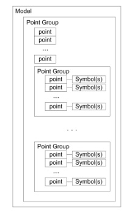

# Shadow-sunspec
> Serializing Sunspec Models for AWS IoT Device Shadow


This document explains how to serialize data from a sunspec-compliant battery energy storage system.  This serialized data can then be sent over the internet (e.g. via MQTT) and interpreted by iot tools such as AWS Device Shadow.  

> ❗ We're using "serialize" here to mean "json encode".  It has nothing to do with a physical serial connection.

## How to Clone

This repo depends on [pysunspec](https://github.com/sunspec/pysunspec).  If you want to be able to run the examples you need all the submodules.  Make sure to clone with the `--recursive` flag.

## Background

### Audience
The audience for this document is software developers working on cloud systems, embedded system designers working on either the firmware or the IoT hardware, and electrical engineers who are familiar with modbus communications but may be less familiar with software.  Because of the diverse audience, there may be parts or whole sections that seem to overexplain simple concepts.

### Sunspec
[Sunspec Modbus](https://sunspec.org/sunspec-modbus-specifications/) is an "open communication standard that specifies common parameters and settings for monitoring and controlling Distributed Energy Resource (DER) systems.  SunSpec Modbus utilizes SunSpec Information Models".

But Modbus, even Modbus TCP, is not a good choice for an IoT platform.  It lacks many features that are necessary for a scalable IoT solution such as 
- security
- device management
- analytics
- interoperability with cloud services

To get these advantages we use the AWS IoT platform.  One powerful feature is the device shadow.  "[Shadows can make a device’s state available to apps and other services whether the device is connected to AWS IoT or not.](https://docs.aws.amazon.com/iot/latest/developerguide/iot-device-shadows.html)"

### Architecture
[Please see the system overview diagram](https://hackmd.io/_whLhpOtSc2Mpk__B7Arqg).  

The Shadow Sunspec is designed to be used to communicate the device state to the IoT Core device shadow service.  

## Design Goals

### Mirror sunspec

One goal of this specification is to stay as close as possible to the data organization in sunspec.  [The python implementation of sunspec](https://github.com/sunspec/pysunspec) is used as a reference.  One thing we change is where the python implementation uses lists.

### Avoiding Arrays

One goal of this specification is to avoid the use of any arrays (lists) in the serialized form of the data.  This is due to how [AWS device shadow updates](https://docs.aws.amazon.com/iot/latest/developerguide/device-shadow-data-flow.html) handle arrays. An update will only change the values that are given.  For large device shaodws this avoids having to resend the entire document.  

For example, the shadow
```json
     "cells": {
        "0": {
          "soc": 99
        },
        "1": {
          "soc": 98
        }
```
could be updated with
```json
     "cells": {
        "1": {
          "soc": 97
        }
```

and the result is 

```json
     "cells": {
        "0": {
          "soc": 99
        },
        "1": {
          "soc": 97
        }
```


Everything in `cells.0` is unchanged.  Only `cells.1` is changed.

However if the device shadow instead was
```json
     "cells": [
         {
          "id": 0,
          "soc": 99
        },
        {
          "id": 1,
          "soc": 98
        }
```
we would have to send the information in `cells` because the entire value of the `cells` is overwritten with each update.  If this cells array were long and each entry had many points, this represents a lot of extra data.

Because a full sunspec implementation can describe a potentially large number of datapoints it is a design goal to minimize the amount of redundant data that must be sent.

### Only include essential information

Only serialize data the essential data.  Do not include metadata or other static values in the serialization.   For example, the full specification for cell voltage is 

| Address | Name |  Type  | Scale Factor | Units | RW Access | Mandatory | Static | Label          | Description              |
|:-------:|:----:|:------:|:------------:|:-----:|-----------|:---------:|--------|----------------|--------------------------|
|    10   |   V  | uint16 |     V_SF     |   V   |           |     M     |        | Module Voltage | Voltage of the   module. |


Of these values, none of them change over time.  Only the actual value of the cell voltage changes.  So there is no reason to include all this metadata in our serialization.  It can be shortened to 

`{"V": 32}`

In the case where the raw value of the modbus register reads 32.  The rest of the metadata can be looked up as needed.  This includes the scaling factor which is generally static.  

## Data Format

[The sunspec information model](SunSpec-Device-Information-Model-Specificiation-V1-0.pdf) gives a description of how data in sunspec is organized  (page 15).  A device is composed of one or more models.  Each model has one or more point groups.  Each point group has one or more points.  It is possible for a model to appear more than one time.  For example, a battery bank (model 802) can have many battery strings (model 803).  In this case, model 802 would be implemented once, and model 803 would be implemented once for each battery string.

> ❗ The above uses "string" in the battery sense of the word, and not the computer science datatype of a character sequece.



To mirror this format, serialize data using these rules
- the highest level data structure is a dictionary
- start with the keyword `models`
- replace lists with a dictionary, where the keys are the list's index (see the example above).
- point groups can be either `fixed` or `repeating`.  Differentiate them using those keywords.
- The keyword for points is the point's Name.
- The value for points is the actual (unscaled) value stored in the modbus register.
- Enums should report their integer value.

```json
{
    "0": <Model>,
    "1": <Model>,
    <...>,
}
```

A `Model` is made up of one or more point groups.  There will always be a fixed point group.  There will then be zero or more repeating point groups.  We can serialize a `Model` as

```json
{
    "id": Model ID number,
    "fixed": {
               Point name: value,
               Point name: value
                <...>
    },
    "repeating": 
            "0": {
               Point name: value,
               Point name: value
                <...>
               },
            "1": {
               Point name: value,
               Point name: value
                <...>
               },
            <...>
}
```

## Example Implementation

### Simple Example
This example covers a fictional energy storage system.  In this example implementation we won't include all the points specified in the sunspec.  We will try to include enough different data types so that this example could be expanded.

Sunspec defines the following levels of organizations for battery cells.
- Cell: A single energy or charge-storing unit
- Module: A single enclosed unit consisting of one or more cells
- String: One or more battery modules connected in series
- Bank: One or more battery strings usually connected in parallel

This simple example considers a battery bank that has 1 battery string.  The string is made up of two battery modules, and each module has 3 battery cells.

```
bank
├── string 1
│   ├── module 1-1
│   │   ├── cell 1-1-1
│   │   ├── cell 1-1-2
│   │   ├── cell 1-1-3
│   ├── module 1-2
│   │   ├── cell 1-2-1
│   │   ├── cell 1-2-2
│   │   ├── cell 1-2-3
```

These are the relevant sunspec models

| Model ID | Model Name                     |
|----------|--------------------------------|
|    802   | Battery Base Model             |
|    803   | Lithium-Ion Battery Bank Model |
|    804   | Lithium-Ion String Model       |
|    805   | Lithium-Ion Module Model       |

The cells are a repeating point group within the module model.  For brevity sake we'll only cover a subset of the points.

In this case we only need model `802` to cover the whole bank, and we need one model `805` for each module.  The other models are redundant and will not be included.

```json
{
    "0": {
      "id": 802,
      "fixed": {
        "AHRtg": 100,
        "SoC": 97,
        "ChaSt": 3,
        "ReqW": -300
      }
    },
    "1": {
      "id": 805,
      "fixed": {
        "StrIdx": 1,
        "ModIdx": 1,
        "SoC": 98,
        "NCell": 3,
        "SN": "ABC123"
      },
      "repeating": {
        "0": {
          "CellV": 32,
          "CellTmp": 39,
          "CellSt": 0
        },
        "1": {
          "CellV": 30,
          "CellTmp": 36,
          "CellSt": 0
        },
        "2": {
          "CellV": 31,
          "CellTmp": 32,
          "CellSt": 0
        }
      }
    },
    "2": {
      "id": 805,
      "fixed": {
        "StrIdx": 1,
        "ModIdx": 2,
        "SoC": 96,
        "NCell": 3,
        "SN": "ABC124"
      },
      "repeating": {
        "0": {
          "CellV": 1,
          "CellTmp": 23,
          "CellSt": 0
        },
        "1": {
          "CellV": 2,
          "CellTmp": 23,
          "CellSt": 0
        },
        "2": {
          "CellV": 1,
          "CellTmp": 22,
          "CellSt": 0
        }
      }
    }
}
```

## eVault

The eVault product has 16 cells, 1 module, and 1 string.  We include model
- 802: required of battery banks
- 803: contains summary level data on the string in the repeating block.  That summary data has the Contactor Status, which is important to Fortress Engineers.
- 805: Module and cell level data.

We can generate the full shadow sunspec along with datatypes.

```python
import json
from pprint import pprint
from shadowsunspec.factory import assemble, ShadowSunspecEncoder
example_device = assemble([
        {'mid': 802}, 
        {'mid': 803},
        {'mid': 805, 'repeating': 16}])

print(json.dumps(example_device, cls=ShadowSunspecEncoder, indent=2))
```

    {
      "0": {
        "fixed": {
          "AHRtg": "uint16",
          "WHRtg": "uint16",
          "WChaRteMax": "uint16",
          "WDisChaRteMax": "uint16",
          "DisChaRte": "uint16",
          "SoCMax": "uint16",
          "SoCMin": "uint16",
          "SocRsvMax": "uint16",
          "SoCRsvMin": "uint16",
          "SoC": "uint16",
          "DoD": "uint16",
          "SoH": "uint16",
          "NCyc": "uint32",
          "ChaSt": "enum16",
          "LocRemCtl": "enum16",
          "Hb": "uint16",
          "CtrlHb": "uint16",
          "AlmRst": "uint16",
          "Typ": "enum16",
          "State": "enum16",
          "StateVnd": "enum16",
          "WarrDt": "uint32",
          "Evt1": "bitfield32",
          "Evt2": "bitfield32",
          "EvtVnd1": "bitfield32",
          "EvtVnd2": "bitfield32",
          "V": "uint16",
          "VMax": "uint16",
          "VMin": "uint16",
          "CellVMax": "uint16",
          "CellVMaxStr": "uint16",
          "CellVMaxMod": "uint16",
          "CellVMin": "uint16",
          "CellVMinStr": "uint16",
          "CellVMinMod": "uint16",
          "CellVAvg": "uint16",
          "A": "int16",
          "AChaMax": "uint16",
          "ADisChaMax": "uint16",
          "W": "int16",
          "ReqInvState": "enum16",
          "ReqW": "int16",
          "SetOp": "enum16",
          "SetInvState": "enum16"
        },
        "id": 802
      },
      "1": {
        "fixed": {
          "NStr": "uint16",
          "NStrCon": "uint16",
          "ModTmpMax": "int16",
          "ModTmpMaxStr": "uint16",
          "ModTmpMaxMod": "uint16",
          "ModTmpMin": "int16",
          "ModTmpMinStr": "uint16",
          "ModTmpMinMod": "uint16",
          "ModTmpAvg": "uint16",
          "StrVMax": "uint16",
          "StrVMaxStr": "uint16",
          "StrVMin": "uint16",
          "StrVMinStr": "uint16",
          "StrVAvg": "uint16",
          "StrAMax": "int16",
          "StrAMaxStr": "uint16",
          "StrAMin": "int16",
          "StrAMinStr": "uint16",
          "StrAAvg": "int16",
          "NCellBal": "uint16"
        },
        "repeating": {
          "0": {
            "StrNMod": "uint16",
            "StrSt": "bitfield32",
            "StrConFail": "enum16",
            "StrSoC": "uint16",
            "StrSoH": "uint16",
            "StrA": "int16",
            "StrCellVMax": "uint16",
            "StrCellVMaxMod": "uint16",
            "StrCellVMin": "uint16",
            "StrCellVMinMod": "uint16",
            "StrCellVAvg": "uint16",
            "StrModTmpMax": "int16",
            "StrModTmpMaxMod": "uint16",
            "StrModTmpMin": "int16",
            "StrModTmpMinMod": "uint16",
            "StrModTmpAvg": "int16",
            "StrDisRsn": "enum16",
            "StrConSt": "bitfield32",
            "StrEvt1": "bitfield32",
            "StrEvt2": "bitfield32",
            "StrEvtVnd1": "bitfield32",
            "StrEvtVnd2": "bitfield32",
            "StrSetEna": "enum16",
            "StrSetCon": "enum16"
          }
        },
        "id": 803
      },
      "2": {
        "fixed": {
          "StrIdx": "uint16",
          "ModIdx": "uint16",
          "NCell": "uint16",
          "SoC": "uint16",
          "DoD": "uint16",
          "SoH": "uint16",
          "NCyc": "uint32",
          "V": "uint16",
          "CellVMax": "uint16",
          "CellVMaxCell": "uint16",
          "CellVMin": "uint16",
          "CellVMinCell": "uint16",
          "CellVAvg": "uint16",
          "CellTmpMax": "int16",
          "CellTmpMaxCell": "uint16",
          "CellTmpMin": "int16",
          "CellTmpMinCell": "uint16",
          "CellTmpAvg": "int16",
          "NCellBal": "uint16",
          "SN": "string"
        },
        "repeating": {
          "0": {
            "CellV": "uint16",
            "CellTmp": "int16",
            "CellSt": "bitfield32"
          },
          "1": {
            "CellV": "uint16",
            "CellTmp": "int16",
            "CellSt": "bitfield32"
          },
          "2": {
            "CellV": "uint16",
            "CellTmp": "int16",
            "CellSt": "bitfield32"
          },
          "3": {
            "CellV": "uint16",
            "CellTmp": "int16",
            "CellSt": "bitfield32"
          },
          "4": {
            "CellV": "uint16",
            "CellTmp": "int16",
            "CellSt": "bitfield32"
          },
          "5": {
            "CellV": "uint16",
            "CellTmp": "int16",
            "CellSt": "bitfield32"
          },
          "6": {
            "CellV": "uint16",
            "CellTmp": "int16",
            "CellSt": "bitfield32"
          },
          "7": {
            "CellV": "uint16",
            "CellTmp": "int16",
            "CellSt": "bitfield32"
          },
          "8": {
            "CellV": "uint16",
            "CellTmp": "int16",
            "CellSt": "bitfield32"
          },
          "9": {
            "CellV": "uint16",
            "CellTmp": "int16",
            "CellSt": "bitfield32"
          },
          "10": {
            "CellV": "uint16",
            "CellTmp": "int16",
            "CellSt": "bitfield32"
          },
          "11": {
            "CellV": "uint16",
            "CellTmp": "int16",
            "CellSt": "bitfield32"
          },
          "12": {
            "CellV": "uint16",
            "CellTmp": "int16",
            "CellSt": "bitfield32"
          },
          "13": {
            "CellV": "uint16",
            "CellTmp": "int16",
            "CellSt": "bitfield32"
          },
          "14": {
            "CellV": "uint16",
            "CellTmp": "int16",
            "CellSt": "bitfield32"
          },
          "15": {
            "CellV": "uint16",
            "CellTmp": "int16",
            "CellSt": "bitfield32"
          }
        },
        "id": 805
      }
    }


If you want to see some example values instead you can do the following.  Note that [data points that are not "Mandatory" will use these values to show that they are unimplemented.  ](https://github.com/sunspec/pysunspec/blob/master/sunspec/core/suns.py).  In this example, we will show dummy data in the following points (written as `model_id.symbol`).

```python
from shadowsunspec.values import example_values, ShadowSunspecValueEncoder
from pprint import pprint
pprint(list(example_values.examples.keys()))
```

    ['805.StrIdx',
     '805.NCell',
     '805.V',
     '805.CellV',
     '805.CellSt',
     '805.CellTmp',
     '802.V',
     '802.A',
     '802.W',
     '802.SoC']


```python
example_values.attach(example_device)
print(json.dumps(example_device, cls=ShadowSunspecValueEncoder, indent=2))
```

    {
      "0": {
        "fixed": {
          "AHRtg": 65535,
          "WHRtg": 65535,
          "WChaRteMax": 65535,
          "WDisChaRteMax": 65535,
          "DisChaRte": 65535,
          "SoCMax": 65535,
          "SoCMin": 65535,
          "SocRsvMax": 65535,
          "SoCRsvMin": 65535,
          "SoC": 489,
          "DoD": 65535,
          "SoH": 65535,
          "NCyc": 4294967295,
          "ChaSt": 65535,
          "LocRemCtl": 65535,
          "Hb": 65535,
          "CtrlHb": 65535,
          "AlmRst": 65535,
          "Typ": 65535,
          "State": 65535,
          "StateVnd": 65535,
          "WarrDt": 4294967295,
          "Evt1": 4294967295,
          "Evt2": 4294967295,
          "EvtVnd1": 4294967295,
          "EvtVnd2": 4294967295,
          "V": 495,
          "VMax": 65535,
          "VMin": 65535,
          "CellVMax": 65535,
          "CellVMaxStr": 65535,
          "CellVMaxMod": 65535,
          "CellVMin": 65535,
          "CellVMinStr": 65535,
          "CellVMinMod": 65535,
          "CellVAvg": 65535,
          "A": 409,
          "AChaMax": 65535,
          "ADisChaMax": 65535,
          "W": 358,
          "ReqInvState": 65535,
          "ReqW": -32768,
          "SetOp": 65535,
          "SetInvState": 65535
        },
        "id": 802
      },
      "1": {
        "fixed": {
          "NStr": 65535,
          "NStrCon": 65535,
          "ModTmpMax": -32768,
          "ModTmpMaxStr": 65535,
          "ModTmpMaxMod": 65535,
          "ModTmpMin": -32768,
          "ModTmpMinStr": 65535,
          "ModTmpMinMod": 65535,
          "ModTmpAvg": 65535,
          "StrVMax": 65535,
          "StrVMaxStr": 65535,
          "StrVMin": 65535,
          "StrVMinStr": 65535,
          "StrVAvg": 65535,
          "StrAMax": -32768,
          "StrAMaxStr": 65535,
          "StrAMin": -32768,
          "StrAMinStr": 65535,
          "StrAAvg": -32768,
          "NCellBal": 65535
        },
        "repeating": {
          "0": {
            "StrNMod": 65535,
            "StrSt": 4294967295,
            "StrConFail": 65535,
            "StrSoC": 65535,
            "StrSoH": 65535,
            "StrA": -32768,
            "StrCellVMax": 65535,
            "StrCellVMaxMod": 65535,
            "StrCellVMin": 65535,
            "StrCellVMinMod": 65535,
            "StrCellVAvg": 65535,
            "StrModTmpMax": -32768,
            "StrModTmpMaxMod": 65535,
            "StrModTmpMin": -32768,
            "StrModTmpMinMod": 65535,
            "StrModTmpAvg": -32768,
            "StrDisRsn": 65535,
            "StrConSt": 4294967295,
            "StrEvt1": 4294967295,
            "StrEvt2": 4294967295,
            "StrEvtVnd1": 4294967295,
            "StrEvtVnd2": 4294967295,
            "StrSetEna": 65535,
            "StrSetCon": 65535
          }
        },
        "id": 803
      },
      "2": {
        "fixed": {
          "StrIdx": 1,
          "ModIdx": 65535,
          "NCell": 16,
          "SoC": 65535,
          "DoD": 65535,
          "SoH": 65535,
          "NCyc": 4294967295,
          "V": 508,
          "CellVMax": 65535,
          "CellVMaxCell": 65535,
          "CellVMin": 65535,
          "CellVMinCell": 65535,
          "CellVAvg": 65535,
          "CellTmpMax": -32768,
          "CellTmpMaxCell": 65535,
          "CellTmpMin": -32768,
          "CellTmpMinCell": 65535,
          "CellTmpAvg": -32768,
          "NCellBal": 65535,
          "SN": 0
        },
        "repeating": {
          "0": {
            "CellV": 303,
            "CellTmp": 306,
            "CellSt": 0
          },
          "1": {
            "CellV": 294,
            "CellTmp": 327,
            "CellSt": 0
          },
          "2": {
            "CellV": 292,
            "CellTmp": 300,
            "CellSt": 0
          },
          "3": {
            "CellV": 280,
            "CellTmp": 310,
            "CellSt": 0
          },
          "4": {
            "CellV": 299,
            "CellTmp": 303,
            "CellSt": 0
          },
          "5": {
            "CellV": 292,
            "CellTmp": 305,
            "CellSt": 0
          },
          "6": {
            "CellV": 292,
            "CellTmp": 320,
            "CellSt": 0
          },
          "7": {
            "CellV": 305,
            "CellTmp": 324,
            "CellSt": 0
          },
          "8": {
            "CellV": 288,
            "CellTmp": 326,
            "CellSt": 0
          },
          "9": {
            "CellV": 312,
            "CellTmp": 322,
            "CellSt": 0
          },
          "10": {
            "CellV": 297,
            "CellTmp": 325,
            "CellSt": 0
          },
          "11": {
            "CellV": 290,
            "CellTmp": 339,
            "CellSt": 0
          },
          "12": {
            "CellV": 290,
            "CellTmp": 329,
            "CellSt": 0
          },
          "13": {
            "CellV": 320,
            "CellTmp": 308,
            "CellSt": 0
          },
          "14": {
            "CellV": 319,
            "CellTmp": 320,
            "CellSt": 0
          },
          "15": {
            "CellV": 283,
            "CellTmp": 302,
            "CellSt": 0
          }
        },
        "id": 805
      }
    }

